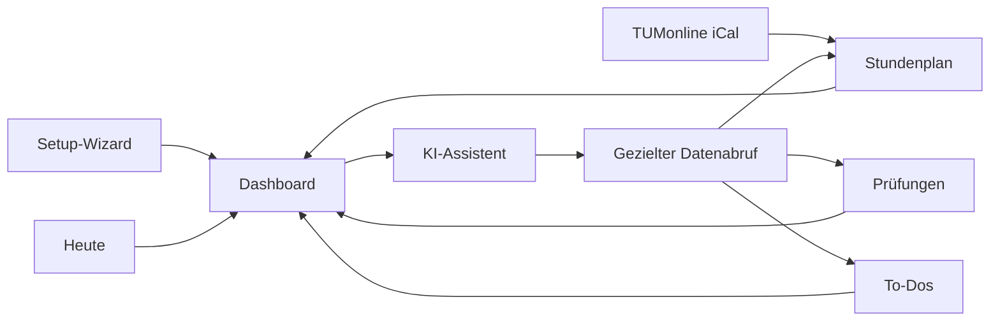

<div align="center">


# TUM Study Portal

### Dein Studium. Ein Dashboard. Deine Daten.

Prüfungen, Stundenplan, Aufgaben und ein privater KI-Assistent – als lokale Desktop-App oder als selbst gehostete PWA fürs iPhone.

[](https://github.com/maxseidlitz/TUM-Study-Portal/releases/latest)
[](https://github.com/maxseidlitz/TUM-Study-Portal/releases/latest)
[](https://github.com/maxseidlitz/TUM-Study-Portal/actions)
[](#-pwa-selbst-hosten)
[](#-privacy-first)

[Download](https://github.com/maxseidlitz/TUM-Study-Portal/releases/latest) · [Features](#-was-ist-drin) · [Self-Hosting](#-pwa-selbst-hosten) · [Entwicklung](#-entwicklung)

</div>

---

## ✨ Was ist drin?

| | Feature | Was es dir bringt |
|---|---|---|
| 🤖 | **KI-Assistent** | Fragt gezielt nur die benötigten Studiendaten ab, erstellt Lernpläne und legt auf Wunsch To-Dos an. |
| 📅 | **Intelligenter Stundenplan** | Importiert TUMonline-iCal, gruppiert Module und berücksichtigt verschobene oder abgesagte Einzeltermine. |
| 📝 | **Prüfungsverwaltung** | Termine, Lernzeiten, ECTS und Notenentwicklung an einem Ort. |
| ✅ | **Aufgabenplanung** | Priorisierte To-Dos mit Fach-, Modul- und Fälligkeitsbezug. |
| ☀️ | **Heute-Ansicht** | Fokussierter Blick auf Vorlesungen, Aufgaben und Termine des Tages. |
| ⏱️ | **Fokus-Timer** | Pomodoro-Einheiten, die sich Prüfungen und Aufgaben zuordnen lassen. |
| 🍽️ | **TUM-Alltag** | Mensa-Speiseplan und wichtige Hochschul-Links direkt erreichbar. |
| 📱 | **iPhone-PWA** | Als App auf dem Home-Bildschirm, mit Touch-Navigation und Offline-Lesen. |
| 🌍 | **Mehrsprachig** | Deutsche, englische und türkische Oberfläche – hell oder dunkel. |

## 🖼️ Einblicke in die App

<table>
  <tr>
    <td width="50%" align="center">
      
      <br /><sub><strong>Geführtes Setup</strong> – Stundenplan und Prüfungen direkt per iCal importieren.</sub>
    </td>
    <td width="50%" align="center">
      
      <br /><sub><strong>Dashboard</strong> – Prüfungen, Aufgaben, Vorlesungen und Empfehlungen im Blick.</sub>
    </td>
  </tr>
  <tr>
    <td width="50%" align="center">
      
      <br /><sub><strong>Stundenplan</strong> – automatisch importieren oder einzelne Termine anlegen.</sub>
    </td>
    <td width="50%" align="center">
      
      <br /><sub><strong>KI-Assistent</strong> – persönliche Unterstützung mit gezieltem Kontextabruf.</sub>
    </td>
  </tr>
  <tr>
    <td colspan="2" align="center">
      
      <br /><sub><strong>Lokale Modelle</strong> – Ollama konfigurieren und ein toolfähiges Modell auswählen.</sub>
    </td>
  </tr>
</table>

## 🚀 Desktop-App starten

### 1. App installieren

**macOS**

1. Lade die aktuelle DMG (Apple Silicon: `arm64`, Intel: `x64`) aus den **[GitHub Releases](https://github.com/maxseidlitz/TUM-Study-Portal/releases/latest)**.
2. Öffne die DMG und ziehe **TUM Study Portal** in den Programme-Ordner.
3. Version 1.0 ist noch nicht notariert. Ohne diesen Schritt meldet macOS die App oft als **beschädigt**:

```bash
xattr -cr "/Applications/TUM Study Portal.app"
```

> Alternativ: Rechtsklick auf die App → **Öffnen** → Sicherheitsdialog bestätigen.
> Falls die DMG selbst nicht gemountet wird, liegt im Release zusätzlich ein `.zip` bereit.

**Windows** – der x64-Installer entsteht bei jedem Push auf `main` als GitHub-Actions-Artefakt. Lokal: `npm run dist:win`.

**Linux** – lokal als AppImage: `npm run dist:linux`.

### 2. Setup-Wizard durchlaufen

Der Wizard führt dich durch:

- persönlichen Stundenplan aus TUMonline importieren,
- Prüfungstermine optional per iCal hinzufügen,
- lokalen KI-Dienst im Hintergrund vorbereiten.

### 3. Lokale KI verwenden

Die App verwendet [Ollama](https://ollama.com/) lokal auf deinem Gerät. Persönliche Studiendaten werden bedarfsgesteuert über begrenzte Tools abgerufen, statt bei jeder Nachricht vollständig in den Modellkontext geladen zu werden. To-Dos aus dem Chat entstehen nur nach ausdrücklicher Zustimmung.

Empfohlene toolfähige Modelle:

```bash
ollama pull qwen3:4b-instruct  # kompakt
ollama pull qwen3:8b           # ausgewogene Empfehlung
ollama pull llama3.1:8b        # robuste Alternative
ollama pull gpt-oss:20b        # leistungsstarke Systeme
```

Modelle ohne Tool-Unterstützung funktionieren weiterhin über einen Vollkontext-Fallback.

## 📱 PWA selbst hosten

Dasselbe Interface läuft als installierbare Progressive Web App auf dem iPhone und im Browser. Der Node-Server hält SQLite, KI und Kalenderimporte serverseitig – der Client spricht nur HTTPS.

Kurzstart:

```sh
cp .env.server.example .env.server
chmod 600 .env.server
# Secrets und PUBLIC_ORIGIN eintragen, siehe docs/SELF_HOSTING.md
docker compose build --pull app
docker compose up -d app
```

Auf dem iPhone in **Safari** öffnen, **Teilen** → **Zum Home-Bildschirm**. Die App startet dann ohne Browser-Chrome, mit Notch-Abstand und Touch-Navigation.

Docker-, HTTPS-, Tailscale-, Backup-, Restore- und Update-Anweisungen stehen in der [Self-Hosting-Dokumentation](docs/SELF_HOSTING.md).

---

## 🔒 Privacy First

- **Lokale Speicherung:** In der Desktop-App bleiben Studiendaten und Chats in der lokalen Datenbank. Self-Hosting speichert sie in deinem eigenen SQLite-Volume.
- **Lokale Inferenz:** Ollama läuft auf deinem Gerät bzw. auf deinem Server.
- **Keine Telemetrie:** Keine Analyse- oder Tracking-Dienste.
- **Kontrollierter Kontext:** Die KI ruft nur Daten ab, die sie für die aktuelle Frage benötigt.
- **Optionales Gemini:** Cloud-KI wird nur nach bewusster Konfiguration verwendet. Der Gemini-Schlüssel bleibt serverseitig und gelangt nicht in den Browser.

> Bei Verwendung von Google Gemini werden die für die Anfrage benötigten Daten an die Google-API übertragen. Ollama bleibt die lokale Standardoption.

## 🧭 Produktbereiche



## 🛠️ Entwicklung

### Voraussetzungen

- Node.js 22.14 (Bereich: `>=22.14.0 <23`)
- npm 10.9
- optional: laufendes [Ollama](https://ollama.com/)

### Lokal starten

```bash
git clone https://github.com/maxseidlitz/TUM-Study-Portal.git
cd TUM-Study-Portal
npm install
npm run dev          # Vite-Renderer im Browser
npm start            # Renderer + Electron
npm run build && npm run server   # Self-Hosted-Backend
```

### Qualität prüfen

```bash
npm test             # Vitest (Renderer)
npm run test:server  # Node-Tests (Backend)
npm run test:all     # beides
npm run test:e2e     # Playwright
npm run build
```

### Desktop-Builds

```bash
npm run dist:mac    # macOS DMG + ZIP, auf macOS ausführen
npm run dist:win    # Windows-Installer, auf Windows ausführen
npm run dist:linux  # Linux AppImage
```

Der GitHub-Workflow baut macOS (arm64 und x64) und Windows. Ein Tag wie `v1.0.0` veröffentlicht die macOS-DMGs und -ZIPs automatisch als GitHub Release.

## 🧩 Architektur

Beide Clients teilen denselben React-Renderer. Der API-Adapter wechselt automatisch:

```text
React Renderer (Desktop / PWA)
  ├─ electronApi  → contextBridge → Electron Main
  │                   store, iCal, AI, Retrieval
  └─ httpApi      → HTTPS /api/v1 → Node-Server
                      SQLite, iCal, Mensa, Ollama, Backups
```

| Bereich | Pfad |
|---|---|
| Seiten und UI | `src/pages`, `src/components` |
| Globaler State | `src/context` |
| Gemeinsame API | `src/api` |
| Hooks | `src/hooks` |
| Hilfs- und Retrieval-Logik | `src/utils`, `public/aiRetrieval.js` |
| Electron IPC | `public/preload.js`, `public/electron.js` |
| Self-hosted Server | `server/` |
| Desktop-Packaging | `package.json`, `.github/workflows/build-desktop.yml` |

Schwere Seiten werden mit `React.lazy` erst bei Bedarf geladen. Desktop- und Server-Backups nutzen dasselbe JSON-Format und lassen sich gegeneinander importieren.

## 📦 Release 1.0

Version 1.0 bündelt den Setup-Wizard, iCal-Import, Prüfungstracking, Aufgabenverwaltung, den KI-Assistenten mit gezieltem Kontextabruf, die PWA fürs iPhone sowie die deutsch-, englisch- und türkischsprachige Oberfläche.

➡️ **[TUM Study Portal 1.0 für macOS herunterladen](https://github.com/maxseidlitz/TUM-Study-Portal/releases/tag/v1.0.0)**

---

<div align="center">

Gebaut für Studierende der TUM – lokal, fokussiert und ohne Datenhunger.

</div>
