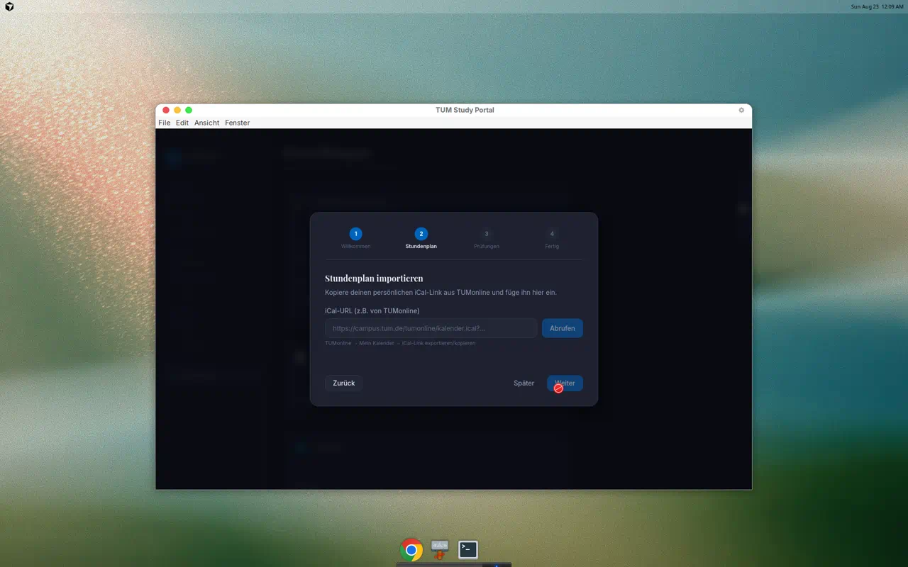
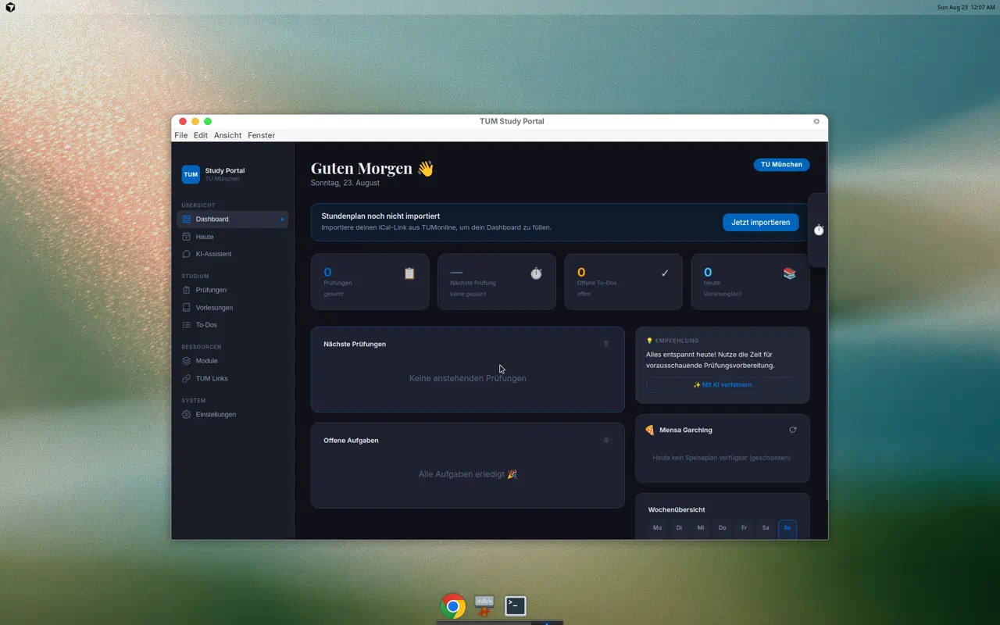
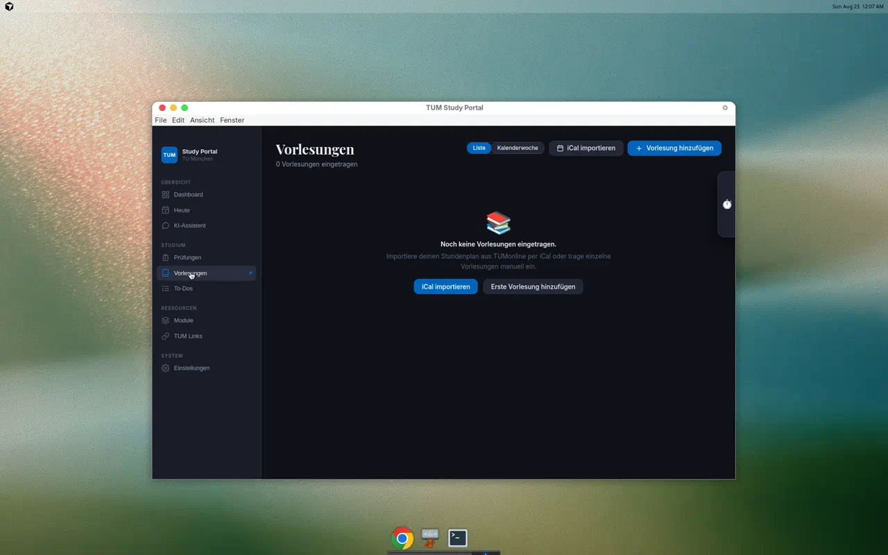
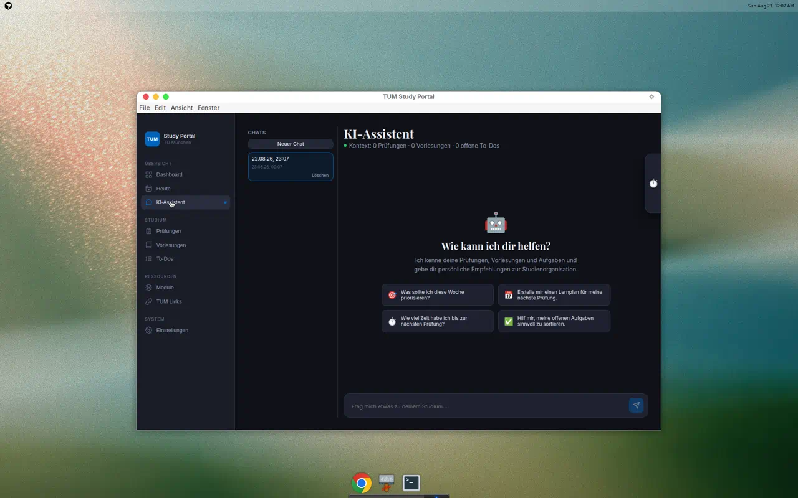
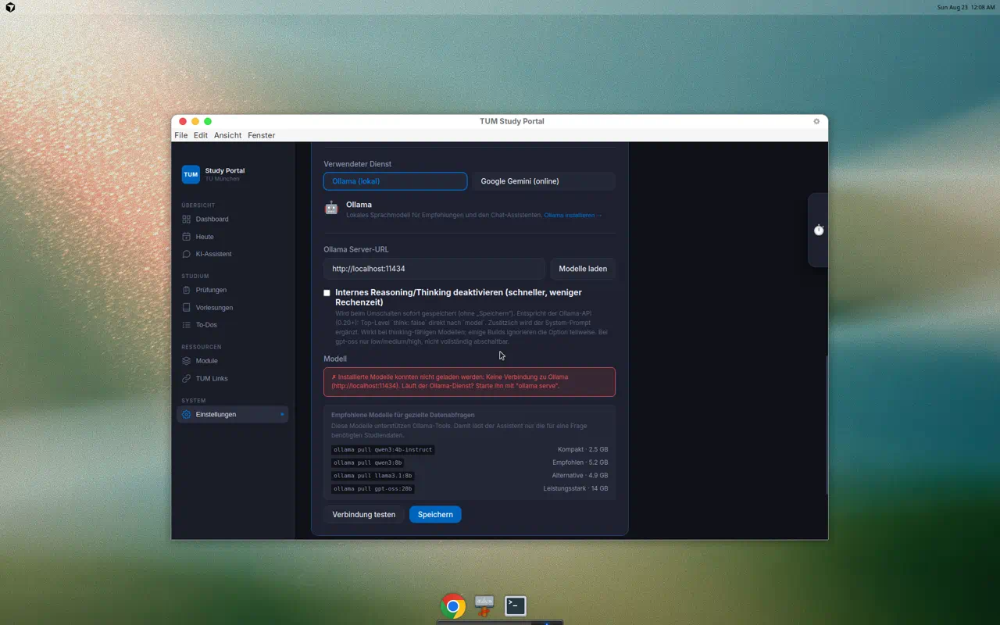
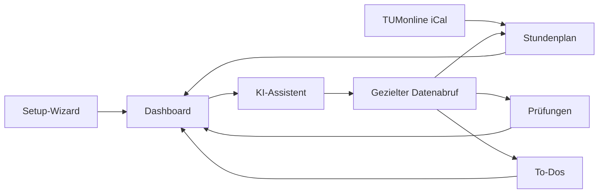

<div align="center">

# 🎓 TUM Study Portal

### Dein Studium. Ein Dashboard. Deine Daten.

Prüfungen, Stundenplan, Aufgaben und ein privater KI-Assistent – als lokale Desktop-App für Studierende der Technischen Universität München.

[](https://github.com/maxseidlitz/TUM-Study-Portal/releases/latest)
[](https://github.com/maxseidlitz/TUM-Study-Portal/releases/latest)
[](https://www.electronjs.org/)
[](#-privacy-first)

[Download](https://github.com/maxseidlitz/TUM-Study-Portal/releases/latest) · [Features](#-was-ist-drin) · [Entwicklung](#-entwicklung) · [Architektur](#-architektur)

</div>

---

## ✨ Was ist drin?

| | Feature | Was es dir bringt |
|---|---|---|
| 🤖 | **Lokaler KI-Assistent** | Fragt gezielt nur die benötigten Studiendaten ab, erstellt Lernpläne und speichert auf Wunsch To-Dos. |
| 📅 | **Intelligenter Stundenplan** | Importiert TUMonline-iCal, gruppiert Module und berücksichtigt verschobene oder abgesagte Einzeltermine. |
| 📝 | **Prüfungsverwaltung** | Termine, Lernzeiten, ECTS und Notenentwicklung an einem Ort. |
| ✅ | **Aufgabenplanung** | Priorisierte To-Dos mit Fach-, Modul- und Fälligkeitsbezug. |
| 🍽️ | **TUM-Alltag** | Mensa, Moodle und wichtige Hochschul-Links direkt erreichbar. |
| 🌍 | **Mehrsprachig** | Deutsche, englische und türkische Oberfläche. |

## 🖼️ Einblicke in die App

<table>
  <tr>
    <td width="50%" align="center">
      
      <br /><sub><strong>Geführtes Setup</strong> – Stundenplan und Prüfungen direkt per iCal importieren.</sub>
    </td>
    <td width="50%" align="center">
      
      <br /><sub><strong>Dashboard</strong> – Prüfungen, Aufgaben, Vorlesungen und Empfehlungen im Blick.</sub>
    </td>
  </tr>
  <tr>
    <td width="50%" align="center">
      
      <br /><sub><strong>Stundenplan</strong> – automatisch importieren oder einzelne Termine anlegen.</sub>
    </td>
    <td width="50%" align="center">
      
      <br /><sub><strong>KI-Assistent</strong> – persönliche Unterstützung mit gezieltem Kontextabruf.</sub>
    </td>
  </tr>
  <tr>
    <td colspan="2" align="center">
      
      <br /><sub><strong>Lokale Modelle</strong> – Ollama konfigurieren und ein toolfähiges Modell auswählen.</sub>
    </td>
  </tr>
</table>

## 🚀 In drei Schritten startklar

### 1. App installieren

1. Lade die aktuelle macOS-DMG aus den **[GitHub Releases](https://github.com/maxseidlitz/TUM-Study-Portal/releases/latest)**.
2. Öffne die DMG und ziehe **TUM Study Portal** in den Programme-Ordner.
3. Da Version 1.0 noch nicht mit einem Apple-Developer-Zertifikat signiert ist, führe einmalig aus:

```bash
xattr -cr "/Applications/TUM Study Portal.app"
```

> Alternativ: Rechtsklick auf die App → **Öffnen** → Sicherheitsdialog bestätigen.

### 2. Setup-Wizard durchlaufen

Der Wizard führt dich durch:

- persönlichen Stundenplan aus TUMonline importieren,
- Prüfungstermine optional per iCal hinzufügen,
- lokalen KI-Dienst im Hintergrund vorbereiten.

### 3. Lokale KI verwenden

Die App verwendet [Ollama](https://ollama.com/) lokal auf deinem Gerät. Persönliche Studiendaten werden bedarfsgesteuert über begrenzte Tools abgerufen, statt bei jeder Nachricht vollständig in den Modellkontext geladen zu werden.

Empfohlene toolfähige Modelle:

```bash
ollama pull qwen3:4b-instruct  # kompakt
ollama pull qwen3:8b           # ausgewogene Empfehlung
ollama pull llama3.1:8b        # robuste Alternative
ollama pull gpt-oss:20b        # leistungsstarke Systeme
```

Modelle ohne Tool-Unterstützung funktionieren weiterhin über einen Vollkontext-Fallback.

---

## 🔒 Privacy First

- **Lokale Speicherung:** Studiendaten und Chats bleiben in der lokalen App-Datenbank.
- **Lokale Inferenz:** Ollama läuft auf deinem Gerät.
- **Keine Telemetrie:** Keine Analyse- oder Tracking-Dienste.
- **Kontrollierter Kontext:** Die KI ruft nur Daten ab, die sie für die aktuelle Frage benötigt.
- **Optionales Gemini:** Cloud-KI wird nur nach bewusster Konfiguration verwendet.

> Bei Verwendung von Google Gemini werden die für die Anfrage benötigten Daten an die Google-API übertragen. Ollama bleibt die lokale Standardoption.

## 🧭 Produktbereiche



## 🛠️ Entwicklung

### Voraussetzungen

- Node.js 18 oder neuer
- npm
- optional: laufendes [Ollama](https://ollama.com/)

### Lokal starten

```bash
git clone https://github.com/maxseidlitz/TUM-Study-Portal.git
cd TUM-Study-Portal
npm install
npm run dev
```

### Qualität prüfen

```bash
npm test
npm run build
```

### Desktop-Builds

```bash
npm run dist:mac    # macOS DMG, auf macOS ausführen
npm run dist:win    # Windows Installer, auf Windows ausführen
npm run dist:linux  # Linux AppImage
```

Der GitHub-Workflow baut die macOS-Version auf einem nativen macOS-Runner. Ein Tag wie `v1.0.0` veröffentlicht die erzeugten DMGs automatisch als GitHub Release.

## 🧩 Architektur

```text
React Renderer
  ↕ contextBridge (preload.js)
Electron Main Process
  ├─ store.js        lokale Persistenz
  ├─ ical.js         Kalenderimport
  ├─ ai.js           Provider- und Tool-Orchestrierung
  └─ aiRetrieval.js  begrenzte, lesende Kontextabfragen
```

| Bereich | Pfad |
|---|---|
| Seiten und UI | `src/pages`, `src/components` |
| Globaler State | `src/context` |
| Hooks | `src/hooks` |
| Hilfs- und Retrieval-Logik | `src/utils`, `public/aiRetrieval.js` |
| Electron IPC | `public/preload.js`, `public/electron.js` |
| Desktop-Packaging | `package.json`, `.github/workflows/build-desktop.yml` |

Schwere Seiten werden mit `React.lazy` erst bei Bedarf geladen.

## 📦 Release 1.0

Version 1.0 bündelt den Setup-Wizard, iCal-Import, Prüfungstracking, Aufgabenverwaltung, den lokalen KI-Assistenten mit gezieltem Kontextabruf sowie die deutsch-, englisch- und türkischsprachige Oberfläche.

➡️ **[TUM Study Portal 1.0 für macOS herunterladen](https://github.com/maxseidlitz/TUM-Study-Portal/releases/tag/v1.0.0)**

---

<div align="center">

Gebaut für Studierende der TUM – lokal, fokussiert und ohne Datenhunger.

</div>