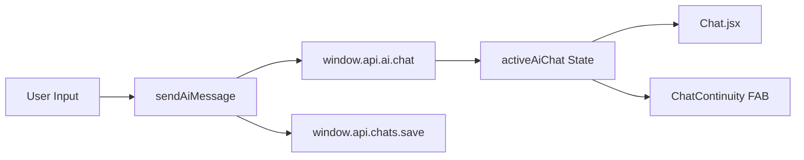

# TUM Study Portal 🎓
Das persönliche Dashboard für Studierende der TU München. Alles an einem Ort: Prüfungen, Stundenplan, To-Dos und ein privater KI-Assistent.

---

## 🚀 Schnelleinstieg (Onboarding)

Willkommen beim TUM Study Portal! Folge diesen Schritten, um in weniger als 5 Minuten startklar zu sein:

### 1. Installation
*   **Windows:** Lade die neueste `.exe` aus den [GitHub Actions Artefakten](https://github.com/maxseidlitz/TUM_Student-Dashboard/actions) herunter und installiere sie.
*   **macOS:** Lade die `.dmg` herunter, ziehe die App in deinen Programme-Ordner und schalte sie einmalig im Terminal frei:
    ```bash
    xattr -cr /Applications/TUM\ Study\ Portal.app
    ```

### 2. Erster Start & KI-Setup
Beim ersten Öffnen lädt die App automatisch die **Ollama-KI-Runtime** und das Sprachmodell (`gemma4:e2b`).
*   Dieser Vorgang dauert je nach Internetleitung ein paar Minuten (ca. 7GB).
*   Ein Fortschrittsbalken zeigt dir den Status an. Sobald dieser fertig ist, ist dein lokaler KI-Assistent einsatzbereit!

### 3. Stundenplan importieren
Gehe zum Tab **Stundenplan** und klicke auf **iCal Import**.
*   Logge dich in [TUMonline](https://online.tum.de) ein.
*   Suche deinen persönlichen Kalender-Link (iCal-Export).
*   Kopiere den Link in die App – dein Stundenplan wird nun automatisch synchronisiert.

---

## ✨ Features im Überblick

### 🤖 Lokaler KI-Assistent (Privacy First)
*   **Chat:** Stelle Fragen zu deinem Studium, lass dir Lernpläne erstellen oder Aufgaben zusammenfassen.
*   **Hintergrund-KI:** Die KI arbeitet weiter, auch wenn du den Chat verlässt. Ein kleiner Roboter-Button unten rechts zeigt dir den Status an.
*   **Mini-Chat:** Über den schwebenden Button kannst du schnell auf Antworten zugreifen, ohne deine aktuelle Ansicht zu verlassen.
*   **Alles lokal:** Deine Chats und Daten verlassen niemals deinen Rechner.

### 📅 Akademisches Dashboard
*   **Prüfungsverwaltung:** Behalte alle Termine im Blick, logge deine Lernstunden und berechne deinen voraussichtlichen Schnitt.
*   **Stundenplan:** Eine übersichtliche Grid-Ansicht deiner Vorlesungen mit automatischer iCal-Synchronisation.
*   **Moodle-Integration:** Direkter Zugriff auf deine Kurse und wichtige TUM-Links.

### ✅ Aufgaben & Organisation
*   **To-Do-Listen:** Verwalte deine Aufgaben mit Prioritäten (Asana-Style).
*   **KI-Aufgaben:** Die KI kann automatisch To-Dos aus deinem Chatverlauf erstellen und für dich speichern.

---

## 🛠️ Entwicklung & Technische Details

### Voraussetzungen
*   Node.js 18+
*   Optional: Ein bereits installiertes [Ollama](https://ollama.ai) (die App nutzt sonst ihre eigene Runtime).

### Lokaler Start
```bash
npm install
npm run dev
```

### Build-Befehle
*   `npm run dist:win`: Erstellt einen Windows-Installer.
*   `npm run dist:mac`: Erstellt ein macOS Disk-Image (.dmg).

### Tests
```bash
npm test
```

---

## Architektur (Entwickler)

### Stack
React (Renderer) ↔ `preload.js` (contextBridge) ↔ Electron `ipcMain` ↔ `store.js` / `ai.js` / `ical.js`

### Provider-Reihenfolge
`LocaleProvider` → `ThemeProvider` → `DataProvider` → App-Shell

### Ordnerkonventionen (`src/`)
| Pfad | Inhalt |
|------|--------|
| `components/icons/` | Gemeinsame SVG-Icons |
| `components/ui/` | Wiederverwendbare UI-Bausteine (z. B. `EmptyState`) |
| `components/chat/` | Chat-Nachrichten, Markdown, Thinking-Bubble |
| `components/exams/`, `lectures/`, `modules/` | Feature-Unterkomponenten |
| `hooks/` | `useChatSessions`, `useEntityCrud` |
| `utils/` | Hilfsfunktionen (`helpers.js`, `chat.js`) |
| `context/` | Globaler State (`DataContext`, `ThemeContext`, `LocaleContext`) |

### `window.api` (über Preload)
| Namespace | Methoden |
|-----------|----------|
| `exams`, `lectures`, `todos`, `modules`, `moodle` | `getAll`, `create`, `update`, `delete` |
| `chats` | `getAll`, `save`, `delete` |
| `settings` | `get`, `save` |
| `studyLogs` | `getByExam`, `create`, `delete` |
| `ai` | `chat`, `getSettings`, `saveSettings`, … |
| `ical` | `fetch`, `parse` |

### Chat-Datenfluss


Schwere Seiten (`Chat`, `Exams`, `Lectures`, `Modules`) werden per `React.lazy` erst bei Navigation geladen.

---

## 🔒 Datenschutz & Sicherheit
*   Alle Daten werden in einer lokalen JSON-Datenbank gespeichert (`%APPDATA%/tum-study-portal`).
*   Keine Telemetrie, kein Cloud-Zwang.
*   Die App ist Open Source – du hast die volle Kontrolle über deine Daten.

---
*Entwickelt für Studenten der TU München.* 🚀